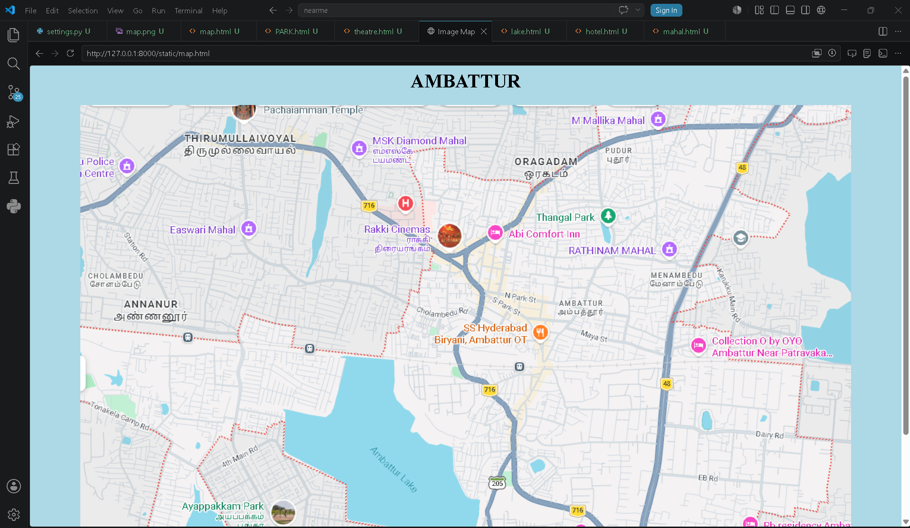

# Ex03 Places Around Me
## Date: 24-05-2026

## AIM
To develop a website to display details about the places around my house.

## DESIGN STEPS

### STEP 1
Create a Django admin interface.

### STEP 2
Download your city map from Google.

### STEP 3
Using ```<map>``` tag name the map.

### STEP 4
Create clickable regions in the image using ```<area>``` tag.

### STEP 5
Write HTML programs for all the regions identified.

### STEP 6
Execute the programs and publish them.

## CODE:
## Map.html
```
<html>
    <head>
        <title>
            Image Map
        </title>
    </head>
    <body bgcolor="lightblue">
        <h1 align="center"><b>AMBATTUR</b></h1>
        <center>
        <map name="image-map">
            <area target="" alt="THANGAL PARK" title="THANGAL PARK" href="PARK.html" coords="913,300,96" shape="circle">
            <area target="" alt="Easwari MAHAL" title="Easwari MAHAL" href="mahal.html" coords="100,148,24" shape="circle">
            <area target="" alt="RAKKI CINEMAS" title="RAKKI CINEMAS" href="theatre.html" coords="725,534,82" shape="circle">
            <area target="" alt="AMBATTUR LAKE" title="AMBATTUR LAKE" href="lake.html" coords="913,760,84" shape="circle">
            <area target="" alt="SS HYDRABED BIRYANI RESTAURENT" title="SS HYDRABED BIRYANI RESTAURENT" href="hotel.html" coords="287,342,20" shape="circle">
        </map></center>

    </body>
</html>
```

## Park.html
```
<!DOCTYPE html>
<html>
<head>
    <title>THANGAL PARK</title>
</head>

<body bgcolor="green">

    <h1>THANGAL PARK</h1>

    <p>
        Thangal Eri Park (also known as Thangal Lake Park or Thangal Poonga) is a 
        massive 17-acre refurbished eco-park located on Madhanakuppam Main Road in 
        the Kallikuppam area of Ambattur, Chennai. Recently transformed by the Greater 
        Chennai Corporation (GCC) at a cost of ₹60 lakh, this prominent green space 
        features an expansive 15-foot-deep lake and serves as a major recreational hub 
        for families, fitness enthusiasts, and nature lovers
    </p>

    <a href="/">Go Back to Map</a>

</body>
</html>
```
## Theatre.html
```
<!DOCTYPE html>
<html>
<head>
    <title>RAKKI THEATRE</title>
</head>

<body bgcolor="grey">

    <h1>RAKKI THEATRE</h1>

    <p>
        Rakki Cinemas is a prominent, well-known multiplex 
        theater located right in the heart of Ambattur, Chennai. 
        Having evolved from a single-screen venue into a modern 
        entertainment complex, it is widely considered the go-to 
        movie destination for residents across the Ambattur,
         Arakkonam, and Thiruvallur regions.
    </p>

    <a href="/">Go Back to Map</a>

</body>
</html>
```
## Lake.html
```
<!DOCTYPE html>
<html>
<head>
    <title>AMBATTUR LAKE</title>
</head>

<body bgcolor="lavender">

    <h1>AMBATTUR LAKE</h1>

    <p>
        Ambattur Lake (Ambattur Aeri) is a historic, rain-fed reservoir 
        spanning roughly 440 acres in Western Chennai that forms a critical
        cascading water system alongside Korattur and Madhavaram lakes. 
        Serving as a crucial source for city drinking water and a natural 
        buffer against monsoon flooding, it has recently undergone a ₹59 crore 
        restoration project by the Water Resources Department to curb urban 
        sewage pollution. Today, the lake features a popular 1.5-kilometre-long 
        brick-tiled walking bund, an open-air gymnasium, and landscaped seating areas, 
        transforming it into a vital ecological habitat for migratory birds and a major 
        morning fitness hub for the Ambattur community.
    </p>

    <a href="/">Go Back to Map</a>

</body>
</html>
```
## Hotel.html
```
<!DOCTYPE html>
<html>
<head>
    <title>SS HYDRABED BIRYANI</title>
</head>

<body bgcolor="yellow">

    <h1>SS HYDRABED BIRYANI</h1>

    <p>
        SS Hyderabad Biryani is one of the most popular 
        non-vegetarian restaurant chains in Chennai, famous 
        for serving highly aromatic, Basmati-style dum biryani 
        in massive, value-for-money quantities. The chain operates 
        two major outlets directly within the Ambattur locality to 
        cater to high consumer demand.
    </p>

    <a href="/">Go Back to Map</a>

</body>
</html>
```
## Mahal.html
```
<!DOCTYPE html>
<html>
<head>
    <title>EASWARI MAHAL</title>
</head>

<body bgcolor="honeydew">

    <h1>EASWARI MAHAL</h1>

    <p>
        Easwari Mahal (also written as Eswari Mahal) is a well-known 
        budget-friendly wedding hall and convention center situated 
        at the Ambattur-Thirumullaivoyal border in Chennai. Established in 2006, 
        this multi-purpose venue is widely used for hosting marriages, receptions, 
        engagements, family functions, and corporate meetups
    </p>

    <a href="/">Go Back to Map</a>

</body>
</html>
```


## OUTPUT


## RESULT
The program for implementing image maps using HTML is executed successfully.
